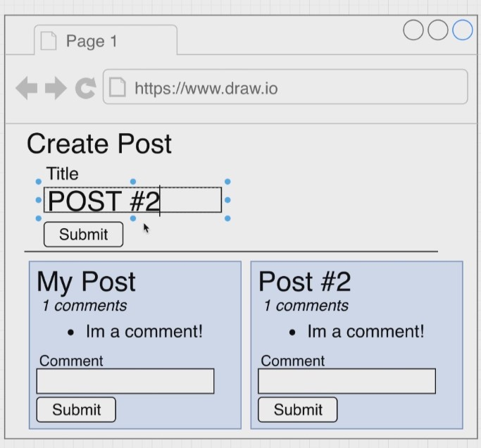

<h1 align="center"><a href="https://github.com/axyut/posting_app_microservice_nodejs">Posting App Microservice</a></h1>

  <p align="center">
    An Implementation of a Post creating app with comments as a microservice for each feature. Services communicate in Async Architecture. An Event Bus created from scratch with express. 
</p>

<!-- TABLE OF CONTENTS -->

## Table of Contents

- [Table of Contents](#table-of-contents)
- [About The Project](#about-the-project)
  - [Built With](#built-with)
- [Getting Started](#getting-started)
  - [Prerequisites](#prerequisites)
  - [Installation](#installation)
- [Working](#working)

<!-- ABOUT THE PROJECT -->

## About The Project

    An Implementation of a Post creating app with comments as a microservice for each feature. Services communicate in Async Architecture. An Event Bus created from scratch with express.

### Built With

This project is build with following languages and framework

- [React](https://html.com)
- [Express](https://developer.mozilla.org/en-US/docs/Web/CSS)
- [Node](https://www.javascript.com/)
- [Axios](https://www.javascript.com/)
- [Concurrently](https://www.javascript.com/)
- [Vite](https://www.javascript.com/)
- [Docker](https://www.javascript.com/)

<!-- GETTING STARTED -->

## Getting Started

This is an example of how you may give instructions on setting up your project locally.
To get a local copy up and running follow these simple example steps.

### Prerequisites

- Text editor

### Installation

1. Fork the repo in your github account.

2. Clone the noDokernoKubernetes branch repo

3. Move toward the Root directory .

```sh
   cd posting_app_microservice_nodejs
```

4. Install required dependencies at root folder

```sh
   npm i
```

5. Install required dependencies for all microservices from root folder

```sh
   npm run install
```

6. Run from root folder

```sh
   npm start
```

<!--Working-->

## Working

1.  [Go to Website](http://localhost:3003)

        This is how it look like after moving on the page.

    <p >
      
    </p>

2.  Post any post

3.  Post any comment
